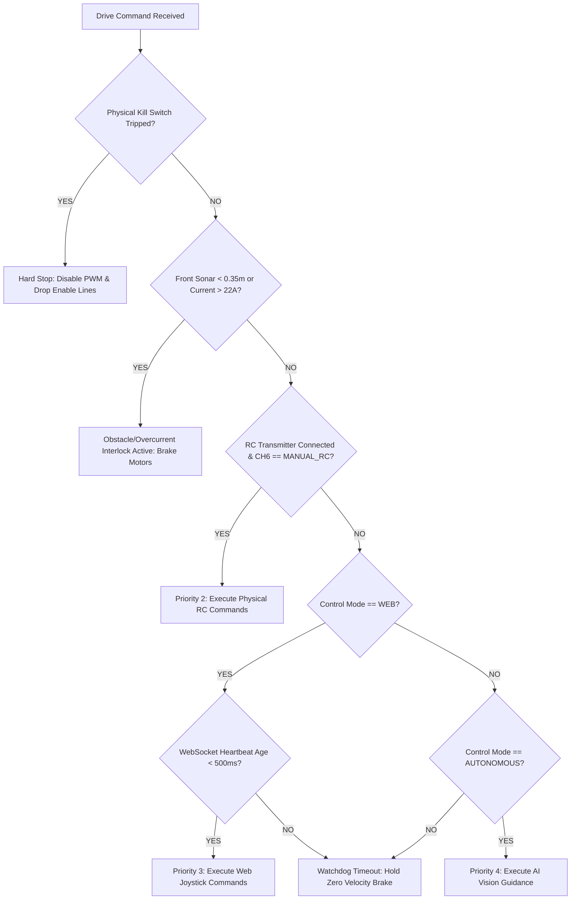

# PRAHARI — Autonomous & RC-Assisted Traffic-Police Robot Master Architecture

> **Official Systems Architecture, Hardware Specification, Electrical Schematics, and Deployment Manual**  
> **Platform**: Raspberry Pi 4 (4GB/8GB Model B) Onboard Computer  
> **Actuation**: 2 × MY1016 Brushed DC Motors + 2 × BTS7960 43A H-Bridges  
> **Power**: 36V 26Ah Dual-Pack Architecture (Fused with Master E-Stop)  
> **Perception**: Mounted Smartphone HD Camera (WebRTC) + Secondary RPi USB/CSI Cam + Ultrasonic Array + 6-DOF IMU  
> **Software**: Next.js 14 Web Command Center + Node.js/Express Backend + Python/pigpio Onboard Daemon + MongoDB Atlas

---

## 1. Complete System Architecture Diagram

```
+-----------------------------------------------------------------------------------------+
|                                    PRAHARI ROBOT CHASSIS                                |
|                                                                                         |
|  +---------------------------+                     +---------------------------------+  |
|  |   2x 36V 13Ah Batteries   |                     |     Mounted Smartphone Camera   |  |
|  +-------------+-------------+                     +----------------+----------------+  |
|                | 60A Main Fuse                                      | WebRTC / Socket   |
|                v                                                    v                   |
|  +-------------+-------------+                     +----------------+----------------+  |
|  | Master Kill Switch (ESTOP)|                     |     RASPBERRY PI 4 (4GB)        |  |
|  +-------------+-------------+                     |   Central Onboard Controller    |  |
|                |                                   +--------+-------+--------+-------+  |
|                +--------+-----------------+                 |       |        |          |
|                |        |                 |                 |       |        |          |
|                v        v                 v                 v       v        v          |
|         30A Fuse    30A Fuse       DC-DC Buck (5V 3A)   +---+  +----+   +----+---+      |
|             |          |                  |             |PWM|  |I2C |   |GPIO In |      |
|             v          v                  v             +---+  +----+   +----+---+      |
|         +-------+  +-------+    +---------+-------+       |      |           |          |
|         |BTS7960|  |BTS7960|    | RPi 4 / Sensors |       |      |           |          |
|         | Left  |  | Right |    +-----------------+       |      |           |          |
|         +---+---+  +---+---+                              |      |           |          |
|             |          |                                  |      |           |          |
|             v          v                                  |      |           |          |
|         +-------+  +-------+                              |      |           |          |
|         |MY1016 |  |MY1016 | <----------------------------+      |           |          |
|         | Left  |  | Right |                                     |           |          |
|         +-------+  +-------+                                     |           |          |
|                                                                  v           v          |
|                                                           +------------+ +-----------+  |
|                                                           | MPU6050    | | FlySky RC |  |
|                                                           | ADS1115 ADC| | Receiver  |  |
|                                                           | HC-SR04    | | (CH1,2,6) |  |
|                                                           +------------+ +-----------+  |
+-----------------------------------------------------------------------------------------+
                                         ^
                                         | Wi-Fi (802.11ac) / LAN
                                         v
+-----------------------------------------------------------------------------------------+
|                            COMMAND CENTER & CLOUD INFRASTRUCTURE                        |
|                                                                                         |
|  +----------------------------+                     +--------------------------------+  |
|  |     Next.js 14 Frontend    | <==== WebSocket === |    Node.js / Express Backend   |  |
|  |  - Virtual Joystick        |      (Socket.IO)    |  - Command Validation Engine   |  |
|  |  - Real-time Telemetry HUD |                     |  - REST APIs (/api/device/...) |  |
|  |  - AI Perception Dashboard |                     |  - Native AI Model Inference   |  |
|  |  - Mobile Camera Broadcaster|                    |  - 100% Real Live Data Engine  |  |
|  +----------------------------+                     +---------------+----------------+  |
|                                                                     |                   |
|                                                                     v                   |
|                                                     +---------------+----------------+  |
|                                                     |   MongoDB Atlas Database       |  |
|                                                     |   - Detections & ANPR Records  |  |
|                                                     |   - Telemetry History Logs     |  |
|                                                     |   - Operator Auth & Auditing   |  |
|                                                     +--------------------------------+  |
+-----------------------------------------------------------------------------------------+
```

---

## 2. Hardware Block Diagram

```
[36V 26Ah Battery Pack] ---> [60A Fuse] ---> [Emergency Kill Switch]
                                                    |
         +------------------------------------------+------------------------------+
         |                                          |                              |
  [30A Left Fuse]                            [30A Right Fuse]             [Step-Down 5V 3A Buck]
         |                                          |                              |
[BTS7960 Left H-Bridge]                   [BTS7960 Right H-Bridge]         [Raspberry Pi 4 VDD_5V]
         |                                          |                              |
[Left ACS758 Current Sensor]              [Right ACS758 Current Sensor]   +--------+--------+
         |                                          |                     |  Raspberry Pi 4 |
   [Left MY1016 Motor]                       [Right MY1016 Motor]         +--------+--------+
                                                                                   |
         +-------------------------------------------------------------------------+
         |                        |                        |                       |
  [I2C-1 Bus (Pin 3,5)]     [PWM Pins 32,33,12,35]   [GPIO Echo/Trig]       [RC Channels]
         |                        |                        |                       |
  +------+------+                 v                        v                       v
  |             |          [BTS7960 Inputs]         [HC-SR04 Sonar]         [FlySky FS-iA6B]
  v             v          (RPWM, LPWM, R_EN, L_EN) (Front & Rear via       (CH1 Steering,
[ADS1115 ADC] [MPU6050]                             Level Shifter)          CH2 Throttle,
  |                                                                         CH6 Mode Switch)
  +--> Ch0: Battery Voltage (15:1 Divider)
  +--> Ch1: Left Motor Current (ACS758)
  +--> Ch2: Right Motor Current (ACS758)
  +--> Ch3: 5V Logic Rail Monitor
```

---

## 3. Raspberry Pi 4 GPIO Pin Map (40-Pin Header)

| Pin # | Function / Name | Broadcom GPIO | Target Hardware Connection | Signal Level |
| :---: | :--- | :---: | :--- | :---: |
| **1** | 3.3V Power | - | MPU6050 VCC / ADS1115 VDD / Pullups | 3.3V DC (Max 50mA) |
| **2** | 5.0V Power | - | DC-DC Step-Down Buck Output (+) | 5.0V DC (3A Rated) |
| **3** | I2C1 SDA | **GPIO 2** | MPU6050 SDA & ADS1115 SDA | 3.3V I2C (Pull-up) |
| **4** | 5.0V Power | - | DC-DC Step-Down Buck Output (+) | 5.0V DC |
| **5** | I2C1 SCL | **GPIO 3** | MPU6050 SCL & ADS1115 SCL | 3.3V I2C (Pull-up) |
| **6** | Ground | - | Common System Ground Bus (GND) | 0V |
| **7** | GPIO | **GPIO 4** | RC Receiver CH6 (3-Pos Mode Switch) | 3.3V Logic |
| **9** | Ground | - | Common Ground | 0V |
| **11** | GPIO | **GPIO 17** | Right BTS7960 L_EN (Reverse Enable) | 3.3V -> 5V Buffer |
| **12** | Hardware PWM0 | **GPIO 18** | Right BTS7960 RPWM (Forward Speed) | 3.3V PWM (1kHz) |
| **13** | GPIO | **GPIO 27** | Right BTS7960 R_EN (Forward Enable) | 3.3V -> 5V Buffer |
| **14** | Ground | - | Common Ground | 0V |
| **15** | GPIO | **GPIO 22** | Left BTS7960 R_EN (Forward Enable) | 3.3V -> 5V Buffer |
| **16** | GPIO | **GPIO 23** | Left BTS7960 L_EN (Reverse Enable) | 3.3V -> 5V Buffer |
| **18** | GPIO In | **GPIO 24** | Left BTS7960 IS Alarm / Current Fault | 3.3V In |
| **20** | Ground | - | Common Ground | 0V |
| **22** | GPIO In | **GPIO 25** | Physical Kill Switch / E-Stop Sense | Active LOW Pull-up |
| **24** | GPIO Out | **GPIO 8** | Status LED Red (E-Stop Active) | 3.3V Out |
| **26** | GPIO Out | **GPIO 7** | Status LED Green (System Nominal) | 3.3V Out |
| **28** | GPIO Out | **GPIO 1** | Safety Siren / Piezo Buzzer Alarm | 3.3V Out |
| **29** | GPIO Out | **GPIO 5** | Front HC-SR04 Trigger Pulse | 3.3V Out (10µs) |
| **31** | GPIO In | **GPIO 6** | Front HC-SR04 Echo (via 1k/2k Divider) | 3.3V In |
| **32** | Hardware PWM0 | **GPIO 12** | Left BTS7960 RPWM (Forward Speed) | 3.3V PWM (1kHz) |
| **33** | Hardware PWM1 | **GPIO 13** | Left BTS7960 LPWM (Reverse Speed) | 3.3V PWM (1kHz) |
| **35** | Hardware PWM1 | **GPIO 19** | Right BTS7960 LPWM (Reverse Speed) | 3.3V PWM (1kHz) |
| **36** | GPIO In | **GPIO 16** | RC Receiver CH1 (Steering Pulse) | 3.3V In |
| **37** | GPIO In | **GPIO 26** | RC Receiver CH2 (Throttle Pulse) | 3.3V In |
| **38** | GPIO Out | **GPIO 20** | Rear HC-SR04 Trigger Pulse | 3.3V Out (10µs) |
| **39** | Ground | - | Common Ground | 0V |
| **40** | GPIO In | **GPIO 21** | Rear HC-SR04 Echo (via 1k/2k Divider) | 3.3V In |

---

## 4. BTS7960 Pin-to-Pin Connections

The BTS7960 contains two 74AHC244 buffer chips and two Infineon BTS7960 half-bridge silicon chips rated for up to 43A continuous.

```
                    BTS7960 PINOUT (Control Header)
          +------------------------------------------------+
          | VCC   GND   R_EN   L_EN   RPWM   LPWM   R_IS  L_IS |
          +--+-----+-----+------+------+------+------+-----+----+
             |     |     |      |      |      |      |     |
             |     |     |      |      |      |      +-----+---> NC or Alarm GPIO
             |     |     |      |      |      +----------------> Reverse PWM (RPi GPIO 13/19)
             |     |     |      |      +-----------------------> Forward PWM (RPi GPIO 12/18)
             |     |     |      +------------------------------> Left/Right L_EN (RPi GPIO 23/17)
             |     |     +-------------------------------------> Left/Right R_EN (RPi GPIO 22/27)
             |     +-------------------------------------------> System Ground (GND)
             +-------------------------------------------------> 5V Logic Rail
```

### High-Current Power Terminals (Screw Lugs):
- **B+ (Battery Positive)**: Connects to 36V Fused Branch (+36V DC via 30A inline fuse).
- **B- (Battery Negative / Power Ground)**: Connects to High-Current Ground Bus.
- **M+ (Motor Terminal 1)**: Connects to Motor Wire A.
- **M- (Motor Terminal 2)**: Connects to Motor Wire B.

---

## 5. MY1016 Motor Connections & Directional Logic

| Direction | Left Motor RPWM | Left Motor LPWM | Right Motor RPWM | Right Motor LPWM | Action |
| :--- | :---: | :---: | :---: | :---: | :--- |
| **FORWARD** | **PWM (50-255)** | 0 | **PWM (50-255)** | 0 | Both wheels drive forward |
| **REVERSE** | 0 | **PWM (50-255)** | 0 | **PWM (50-255)** | Both wheels drive reverse |
| **SPIN LEFT** | 0 | **PWM (50-200)** | **PWM (50-200)** | 0 | Left reverse, Right forward |
| **SPIN RIGHT** | **PWM (50-200)** | 0 | 0 | **PWM (50-200)** | Left forward, Right reverse |
| **BRAKE** | 0 | 0 | 0 | 0 | Dynamic low-side braking |

---

## 6. RC Receiver Connections (FlySky FS-iA6B / Radiomaster)

1. **VCC**: Connects to 5V Regulated Rail.
2. **GND**: Connects to System Ground Bus.
3. **CH1 (Steering)**: Pin 36 (GPIO 16) — 1000µs (Left) to 2000µs (Right).
4. **CH2 (Throttle)**: Pin 37 (GPIO 26) — 1000µs (Reverse) to 2000µs (Forward).
5. **CH6 (3-Pos Mode Switch)**: Pin 7 (GPIO 4) — 
   - Position 1 (<1300µs): **MANUAL RC** (RC sticks take absolute control).
   - Position 2 (1300-1700µs): **WEB CONTROL** (Command Center web app controls robot).
   - Position 3 (>1700µs): **AUTONOMOUS** (Corridor autopilot / AI follow mode).

---

## 7. HC-SR04 Ultrasonic Voltage Divider Circuit

> [!CAUTION]
> The HC-SR04 Echo output is **5.0V TTL**. Connecting it directly to Raspberry Pi GPIO will damage the Broadcom SoC! A 1kΩ / 2kΩ voltage divider is mandatory on the Echo line.

```
       HC-SR04 ECHO PIN (5.0V Output)
                     |
                   [1 kΩ] Resistor
                     |
                     +-----> RPi GPIO 6 / 21 Input (3.3V Safe: 5V * (2k / (1k + 2k)) = 3.33V)
                     |
                   [2 kΩ] Resistor
                     |
                  Ground (GND)
```

---

## 8. MPU6050 & ADS1115 I2C Bus Circuit

Both modules share the standard Raspberry Pi 4 I2C-1 bus:
- **Pin 3 (GPIO 2 / SDA)** ➔ MPU6050 SDA & ADS1115 SDA
- **Pin 5 (GPIO 3 / SCL)** ➔ MPU6050 SCL & ADS1115 SCL
- **Pin 1 (3.3V)** ➔ MPU6050 VCC & ADS1115 VDD
- **Pin 6 (GND)** ➔ MPU6050 GND & ADS1115 GND

---

## 9. 36V Battery Voltage Divider Circuit

The ADS1115 ADC has a maximum single-ended input range of 0 to 4.096V. To measure a 36V battery pack (which reaches 42.0V when fully charged), a **15:1 precision voltage divider** is used:

```
  36V BATTERY (+) BUS (Fused)
            |
         [150 kΩ] 1% Metal Film Resistor (R1)
            |
            +-----> ADS1115 AIN0 Input (At 42.0V max, Vout = 42V * (10k / 160k) = 2.625V)
            |
         [10 kΩ]  1% Metal Film Resistor (R2)
            |
       Common Ground (GND)
```

**ADC Voltage Calculation in Software:**
```python
battery_voltage = ads1115_ain0_voltage * 16.0
```

---

## 10. Power Distribution & Wire Gauge Specifications

```
+-----------------------------------------------------------------------------------+
|                            POWER DISTRIBUTION DIAGRAM                             |
|                                                                                   |
|  [36V 13Ah Pack 1] --+                                                            |
|                      +--> [60A Main Fuse] --> [Master E-Stop Switch]              |
|  [36V 13Ah Pack 2] --+                                     |                      |
|  (Parallel: 36V 26Ah)                                      +----------------+     |
|                                                            |                |     |
|                                                    [30A Left Fuse]   [30A Right]  |
|                                                            |                |     |
|                                                      [BTS7960 L]       [BTS7960 R]|
|                                                            |                |     |
|                                                      [MY1016 L]        [MY1016 R] |
|                                                                                   |
|  [36V Main Bus] --> [DC-DC Step-Down (36V -> 5V 3A)] --> [Raspberry Pi 4 5V Rail] |
|  [36V Main Bus] --> [DC-DC Step-Down (36V -> 12V 2A)] -> [LED Strobe / Horn Rail] |
+-----------------------------------------------------------------------------------+
```

### Wire Gauge (AWG) Sizing Table:

| Segment | Maximum Current | Recommended Wire Gauge | Wire Type |
| :--- | :---: | :---: | :--- |
| **Battery to Main Fuse / E-Stop** | 60A Peak | **8 AWG** | High-temp Silicone Flexible Cable |
| **E-Stop to BTS7960 Power Inputs** | 30A Continuous | **10 AWG / 12 AWG** | Silicone Multistrand Cable |
| **BTS7960 to MY1016 Motors** | 22A Continuous | **12 AWG** | Silicone Multistrand Cable |
| **Step-Down Buck to Raspberry Pi** | 3A Continuous | **18 AWG / 20 AWG** | Copper Stranded Wire |
| **Logic & Sensor Lines (GPIO/I2C)** | < 100mA | **24 AWG / 26 AWG** | Ribbon / Dupont Wire |

---

## 11. 4-Tier Safety & Control Hierarchy



---

## 12. Mobile Phone Camera Live Broadcasting

Mounting a smartphone on the robot mast transforms it into an AI sensor node:
1. Smartphone opens `https://<ip>:3000/mobile-camera`.
2. Camera captures 1080p video at 15–30 FPS with hardware orientation stabilization.
3. Frames are streamed over WebSocket directly into the Node.js AI perception engine.
4. AI runs vehicle classification, license plate ANPR/OCR, and emergency ambulance detection.
5. In case of network disconnection, the robot safety watchdog stops the wheels after 500ms while keeping local RC control available.

---

## 13. Step-by-Step Installation & Verification Guide

### Step 1: Raspberry Pi 4 Setup
```bash
# Update OS and install pigpio daemon
sudo apt update && sudo apt install -y pigpio python3-pigpio python3-pip i2c-tools python3-smbus

# Enable I2C & Serial hardware
sudo raspi-config nonint do_i2c 0
sudo raspi-config nonint do_serial 2

# Enable and start pigpio daemon
sudo systemctl enable pigpiod
sudo systemctl start pigpiod
```

### Step 2: Install Python Onboard Dependencies
```bash
cd /home/pi/prahari-traffic-police-robot-command-center/rpi4-onboard
pip3 install -r requirements.txt
```

### Step 3: Install and Start Systemd Daemon Service
```bash
sudo cp prahari-robot.service /etc/systemd/system/
sudo systemctl daemon-reload
sudo systemctl enable prahari-robot.service
sudo systemctl start prahari-robot.service
sudo systemctl status prahari-robot.service
```

### Step 4: Command Center Backend & Frontend Startup
```bash
# Terminal 1: Backend
cd backend
npm install
npm run dev

# Terminal 2: Frontend
cd frontend
npm install
npm run dev
```

---

## 14. Hardware Safety Checklist Before Powering 36V

- [ ] Ensure **Master E-Stop Switch** is accessible and in the **OFF (Open)** position.
- [ ] Verify **60A Main Fuse** and individual **30A Motor Fuses** are installed.
- [ ] Confirm **1kΩ/2kΩ voltage dividers** are installed on all HC-SR04 Echo pins.
- [ ] Check that the **15:1 voltage divider** is connected between the 36V battery bus and ADS1115 AIN0.
- [ ] Measure the output of the DC-DC step-down buck converter with a multimeter to verify **exactly 5.1V** before plugging into Raspberry Pi 4.
- [ ] Verify **Common Ground (GND)** is shared between battery negative, BTS7960 drivers, ADC, and Raspberry Pi.
- [ ] Turn on the physical RC transmitter before enabling motor power.
- [ ] Conduct bench test with robot wheels elevated off the ground.
